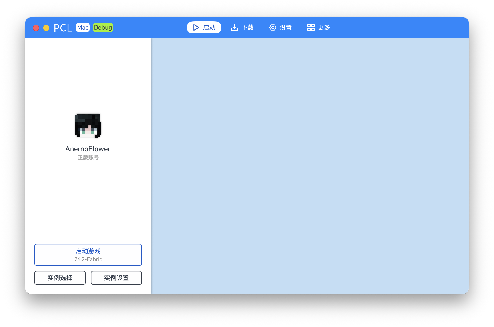
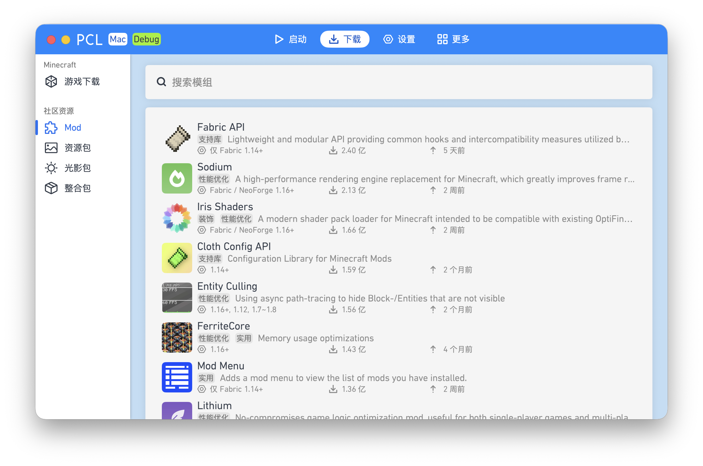

  
  <h1>PCL.Mac</h1>
  
  
  
  

 

PCL.Mac 是 [Plain Craft Launcher](https://github.com/Meloong-Git/PCL)（由 [龙腾猫跃](https://afdian.com/a/LTCat) 制作的 Minecraft 启动器）的**非官方**重构版，使用 SwiftUI 框架**完全重构**了 PCL 以支持 macOS。

<table>
  <tr>
    <td></td>
    <td></td>
  </tr>
</table>

用户群（QQ）：见[官方网站](https://cylorine.studio/projects/PCL.Mac.Refactor#user_group)

**请不要在 PCL 官方版本 / 其它版本相关仓库或群聊中反馈关于 PCL.Mac 的问题。**

## 下载
你可以在 [Releases](https://github.com/CylorineStudio/PCL.Mac.Refactor/releases) 中下载 PCL.Mac（Universal）。 

我们已为 v1.0.1 及以上版本添加了签名和有效公证票据，无需进入系统设置放行。

## 环境要求

|          |          最低           |    推荐     |
|:--------:|:-----------------------:|:-----------:|
| 普通使用 |       macOS 12.0        | macOS 14.0+ |
|   开发   | macOS 14.5+ (Xcode 16+) |      —      |

同时支持 Intel 与 Apple 芯片。

## 许可证
- PCL.Mac 使用与 [PCL](https://github.com/Meloong-Git/PCL) 相同的许可证，并遵守其中关于“重度使用”的规定。
- PCL.Mac.Core（`PCL.Mac.Core/`）采用 MIT License 协议，使用其代码时请**保留许可证**及署名信息。
